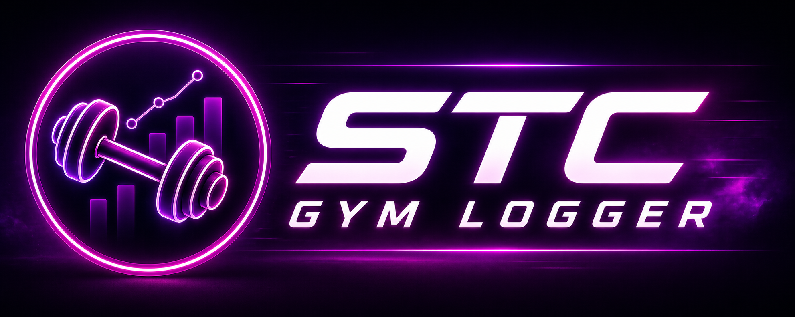

# 🏋️ STC Gym Logger

Mobile-first gym workout logger built with Ionic, Angular, ASP.NET Core, PostgreSQL, Docker, Kubernetes, Azure and CI/CD.

## 📁 Project Structure

```text
stc-gym-logger/
  apps/
    mobile/          # Ionic, Angular and Capacitor mobile app
    api/             # ASP.NET Core Web API
  infrastructure/    # Docker, Kubernetes, Azure and CI/CD configuration
  docs/              # Developer documentation and useful commands
  docker-compose.yml # Local PostgreSQL database
  README.md
```

## 🧰 Tech Stack

### Frontend

```text
Ionic
Angular
Capacitor
PWA
TypeScript
```

### Backend

```text
ASP.NET Core Web API
Entity Framework Core
PostgreSQL
REST API
```

### DevOps / Cloud

```text
Docker
GitHub Actions
Azure Static Web Apps
Azure Container Apps
Local Kubernetes with k3d/minikube
Azure Container Registry, later if needed
```

### Local Tools

```text
GitHub
GitHub CLI
Node.js + npm
Ionic CLI
.NET SDK
Docker Desktop / Docker in WSL
PostgreSQL via Docker Compose
```

## 📚 Documentation

- [Developer setup](docs/developer-setup.md)
- [Daily workflow commands](docs/daily-workflow-commands.md)
- [Exercise model](docs/models/exercises.md)
